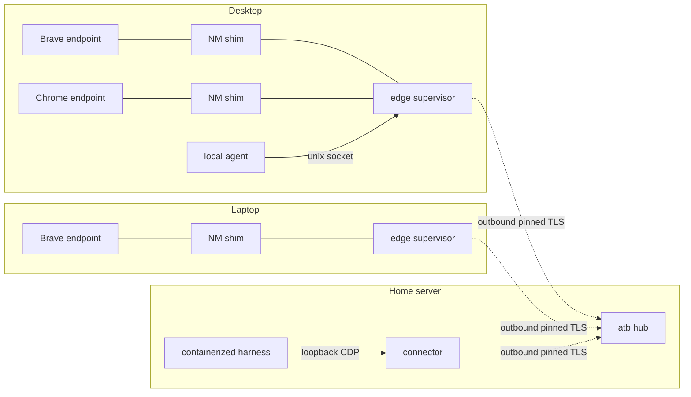

# Agent Tab Bridge — Approved Architecture

Status: **approved** 2026-07-31, by three-architect consensus (Fable, Sol, Kimi) after
structured debate. This document supersedes the ROADMAP Release 2 hub sketch and is the
reference for the mesh end state. Scope is deliberately a minimum viable specification:
it fixes boundaries, invariants, and trust relationships, not implementation detail.

## End state in one paragraph

Agent Tab Bridge works on one machine with zero configuration, exactly as today, and can
optionally join a home mesh through a zero-authority hub on a home server. Browsers and
agents never listen on the LAN; only the hub does. All consent, session authority, and
standing grants remain in the browser extension. The hub is a directory and ciphertext
router: compromising it yields denial of service and traffic metadata, never page data,
sessions, or impersonation.

## Components

| Component | Cardinality | Role | Listens on |
|---|---|---|---|
| Extension endpoint | per browser profile | Sole consent authority: popup approvals, standing grants, tab groups, debugger ownership, final URL/CDP policy | nothing |
| NM shim | per Native Messaging connection | Thin stdio ↔ local-socket proxy; spawned/killed freely by the browser; transport only, never identity | nothing |
| Edge supervisor | per machine, lazy | Machine identity, profile enrollments, broker, task sessions, relay bridges, hub channel; multiplexes N endpoints; spawned by first shim, exits per lifecycle rules | per-endpoint 0600 unix sockets + supervisor control socket (loopback machine only) |
| Hub (`atb hub`) | optional, per home | Device/endpoint directory, presence, opaque stream router, revocation fan-out | one explicitly configured LAN port |
| Harness connector | wherever an agent runs | Dials hub outbound, terminates E2E channel, mints task-scoped loopback `BROWSER_CDP_URL` | loopback only |

The supervisor is **not** an installer-registered service. First shim starts it
atomically; a live-endpoint registry file (convenience, never a trust anchor) maps
endpoint IDs and labels to sockets for CLI discovery.

## Trust relationships

Four distinct relationships; none implies another.

1. **Extension endpoint ↔ edge**: existing P-256 mutual handshake and pinning, carried
   end-to-end through the shim. Endpoint identity = verified extension-install
   fingerprint + user label.
2. **Edge machine ↔ hub**: one-time PAKE/SAS ceremony (SPAKE2+ class) binding both
   long-term keys, roles, and protocol; thereafter pinned mutually authenticated TLS,
   outbound from the edge. One ceremony per machine. A machine pairing never enables an
   endpoint: each browser requires a local "enable this endpoint for <hub>" action.
3. **Connector ↔ hub**: authenticated hop transport for admission and routing. Hub ACLs
   gate resource use only; they can never grant browser authority.
4. **Controller profile ↔ edge**: end-to-end. Profile enrollment (pairing-code popup
   ceremony) terminates at the edge, once per machine; the edge pushes signed enrollment
   statements to the hub directory (hub may gossip, cannot inject principals). Profile
   challenge-response authentication terminates at the edge for every session, relayed
   opaquely through the hub. SSH is not used as a hidden LAN transport.

## Channel construction

- **v2 transcripts** replace `profileAuthTranscript` (nonce+name is too weak for relayed
  transport). A signed transcript binds: both static fingerprints and roles, fresh
  ephemeral ECDH keys and nonces, protocol/cipher versions, machine and endpoint IDs,
  hub/route/stream IDs, the exact requested authority (scope, TTL, stable key), and
  expiry.
- **E2E channel**: both sides sign the ephemeral exchange with their static P-256 keys
  (static keys are never used directly for ECDH); HKDF derives directional AEAD keys;
  frames carry monotonic counters; replay is rejected (a replayed request consuming a
  standing grant is the canonical attack).
- **Hop TLS** (pinned, TLS 1.3) runs underneath E2E on every hub leg. Different threat:
  LAN metadata protection and hub admission. Neither layer replaces the other.
- The hub routes bounded opaque frames. It never reads CDP, never terminates profile
  auth, never mints sessions. A plaintext-CDP hub is permitted only as a private,
  clearly labeled topology experiment, never a release protocol.

## Consent and display

- Approval cards and session rows show: **verified controller** (profile name +
  fingerprint), **via verified hub** (pinned hub label + fingerprint), requested scope,
  TTL, and unverified context. A connector-supplied machine label is **unverified
  context** — a profile signature proves the controller supplied the string, not where
  the key lives. Machine labels become verifiable only via a later node-key enrollment
  pinned at the edge and bound into the transcript.
- Standing grants become `(endpoint, controller principal, route policy, access
  ceiling)`. Existing grants migrate **local-only**; a pre-mesh grant can never be
  consumed remotely without a fresh approval. Full access is never remembered; every
  access upgrade prompts. No unverified string participates in policy.
- Remote access requires named profiles. The shared-secret "Local controller" identity
  is local-only and never exported.

## Lifecycle and degradation

- **Local flow is hub-free**: endpoint registry → unix socket → existing pending →
  popup approval → loopback relay → child-only `BROWSER_CDP_URL`. With exactly one live
  endpoint the CLI selects it; with several, `--browser` is required.
- **Mesh code is inert when unconfigured**: no listener, no reconnect loop, no LAN
  traffic.
- **Hub absent/lost**: local sessions unaffected; remote establishment fails closed with
  actionable status; routed sessions and their connector loopback URLs close
  immediately; reconnection restores presence, never sessions. Durable trust (pins,
  enrollments, grants) survives outages at the endpoints.
- **Endpoint loss** (native port gone): that endpoint's tabs detach and its routed
  relays close immediately.
- **Supervisor exit policy** (resolved): on last-shim disconnect with zero live or
  pending sessions and zero broker clients, exit immediately. Otherwise hold a bounded
  ~2-minute recovery grace: session records (approval, principal, scope, stable key)
  are retained but all authority is suspended; state is resumed only after the same
  pinned extension identity re-handshakes and re-syncs. At expiry without return,
  revoke fail-closed and exit. The hub channel never counts as liveness and never keeps
  the supervisor alive. Rationale: this converts the MV3 mid-session cliff (a Release 1
  defect) into recovery without allowing session resurrection past re-verified endpoint
  identity.
- **Crash/restart**: active sessions are not restored.

## Non-goals (unchanged from ROADMAP, restated for the mesh)

- No Tailscale/tailnet dependency (incidental operation over one is fine).
- No mDNS/discovery as trust anchor; post-enrollment convenience only.
- No public-internet relay, cloud rendezvous, or account service.
- No persistent remote-debugging port; no extension or CDP listener on a LAN interface.
- No hub-side policy store, consent authority, or identity oracle.

## Release-gate invariants

Prove before calling the mesh stable (kept terse; these are gates, not a test plan):

1. Two simultaneous browsers on one machine work; ambiguous CLI selection refuses to guess.
2. Supervisor lazy start, shim churn, recovery grace, stale-registry cleanup, crash.
3. Hub compromise simulation: cannot decrypt CDP, impersonate a principal, consume a
   standing grant, or alter approved scope.
4. Replay, transcript substitution, downgrade, and wrong-endpoint routing are rejected.
5. Revocation fan-out (tab, session, profile, endpoint, hub, device) is immediate.
6. No LAN listener exists on browser or agent machines; hub loss leaves local sessions
   operational and remote sessions dead.
7. Legacy standing grants cannot be consumed remotely.
