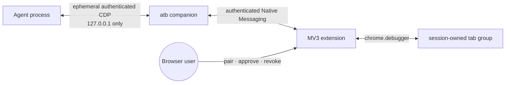

# Agent Tab Bridge

Agent Tab Bridge is an experimental Brave/Chrome extension and local companion that gives an agent CDP access to explicitly shared tabs in an existing browser profile—without a persistent remote-debugging port.

Brave is the primary development target. This repository is a source-only work in progress, not a packaged release.

## Why

Launching a browser with `--remote-debugging-port` exposes a broad automation surface and usually means maintaining a separate automation profile or accepting that CDP is always available. Agent Tab Bridge instead uses Chrome's visible `chrome.debugger` consent surface:

- You explicitly share or unshare a tab from the extension.
- Shared tabs live in a visibly labelled tab group.
- Tabs outside that group are not reported to the CDP relay or attachable by clients.
- Dragging a tab out of the group immediately revokes access.
- The browser's debugger banner remains visible; dismissing it revokes access.
- The relay exists only for the current task, binds to `127.0.0.1`, and requires an ephemeral token.

The immediate motivation was finding a narrow, user-consented way to expose an existing Brave session to [Hermes](https://github.com/NousResearch/hermes-agent) through its `BROWSER_CDP_URL` interface. The bridge itself is intentionally agent-agnostic: any compatible CDP client can use the authenticated loopback endpoint.

## How it fits together



The companion is installed as a Chromium Native Messaging host. The extension and companion authenticate and pin each other's device identity. For each approved task, the companion starts a token-protected loopback relay and injects its short-lived `BROWSER_CDP_URL` only into the launched child process.

The extension remains the authority for browser access. It owns the visible consent UI, tab groups, target filtering, and immediate revocation. Agent Tab Bridge does not import the browser profile's cookie store or expose a reusable browser-wide debugging endpoint; after a tab is shared, its page content and page-accessible state are available through CDP.

## Project status

> [!WARNING]
> This is an early, source-only prototype. The CLI, Native Messaging protocol, and installation layout may change without migration support. Use a disposable browser profile until you have reviewed the code and consent model.

Working today:

- Trusted same-machine operation with an authenticated Native Messaging companion and an ephemeral relay bound only to `127.0.0.1`.
- Browser-local approval for selected tabs, approved domains, or full website access; full access still requires tabs to enter the session's visible group.
- Named sessions, separately approved access upgrades, session-aware tab inventory, ownership conflict detection, and explicit revocation.
- Live end-to-end acceptance in Brave, plus automated protocol, relay, authorization, and extension-UI coverage.

Not yet provided:

- A packaged, signed, notarized, npm, or browser-store release.
- A stable public CLI/protocol or migration support for stored identities.
- An external security audit or a claim that the prototype is safe for unattended use.
- Full acceptance on regular Google Chrome; current Chrome coverage uses Chrome-for-Testing.
- Session recovery across companion/browser restarts, trusted-LAN operation, bookmarks/history access, managed actions, or Guardian Auto.

See [`ROADMAP.md`](ROADMAP.md) for implemented boundaries, remaining hardening, and later capability work.

## Developer build and install

Requires Node.js 22 or newer. Installation currently points the browser's Native Messaging manifest at this checkout, so moving the repository requires reinstalling the companion.

```bash
npm ci
npm run build
npm test
node dist/src/atb.js install
node dist/src/atb.js status
```

Load the extension from this checkout:

1. Open `brave://extensions` or `chrome://extensions`.
2. Enable **Developer mode** and choose **Load unpacked**.
3. Select `extensions/browser/chrome-extension/`.
4. Open the Agent Tab Bridge popup and choose **Connect companion**.
5. Confirm that **Companion connected** and an abbreviated verified identity appear.

The manifest's committed public key gives the unpacked extension a stable ID. The installer derives the allowed Native Messaging origin from that manifest rather than accepting an extension ID from the command line.

To remove the browser registration later:

```bash
node dist/src/atb.js uninstall
```

## Consent model

Agent Tab Bridge separates device trust, session scope, and actual tab control:

| Layer | What it grants | What it does not grant |
|---|---|---|
| Paired companion | Authenticated Native Messaging and enumeration of eligible HTTP/HTTPS tab IDs, titles, URLs, and ownership state | Page content or CDP control |
| Enrolled agent profile | Challenge-response broker authentication under a named public-key principal | Any browser session or tab access by itself |
| Standing session grant | Automatic approval of future sessions from one enrolled principal up to selected-tab or listed-domain scope | Full website access, access upgrades, or authority for another principal |
| Approved task session | Permission to claim selected tab IDs, matching domains, or any website under an elevated full-access grant | Control of tabs not in that session's group |
| Session-owned tab group | CDP discovery and control for those grouped tabs through that session's relay | Access to ungrouped tabs or tabs owned by another session |

This distinction is deliberate: tab metadata is visible to the trusted local companion so an agent can identify what to request, but page access begins only after the tab is both permitted by the session grant and visibly adopted into its group. A tab can belong to at most one session.

## Run a task

Launch the agent as a child of `atb run`. With no access option, the session starts in selected-tab mode and tabs are shared manually:

```bash
node dist/src/atb.js run --label "Research task" -- hermes
```

List the eligible tabs visible to the paired local companion, then use a tab ID in a session request:

```bash
node dist/src/atb.js tabs
```

Request exactly one initial access level when the task starts:

```bash
node dist/src/atb.js run --session research --label "Research task" --tab 246 -- hermes
node dist/src/atb.js run --session research --label "Research task" --domain example.com -- hermes
node dist/src/atb.js run --session research --label "Research task" --full-access -- hermes
```

`--tab` and `--domain` may each be repeated. A domain includes its subdomains. Full access is intentionally the highest-salience approval and still controls only tabs in the session's colored group; it does not expose ungrouped personal tabs.

The popup shows the authenticated controller principal, unverified task label, requested capability, access level, and TTL. Approve the task once. Selected tabs named on the command line are adopted into the task group; domain and full-access sessions can open permitted sites directly. Dragging any controlled tab out of the group revokes that tab immediately.

Named sessions remain active after their child command exits. A later command may request a monotonic access upgrade without restarting the session:

```bash
node dist/src/atb.js request-access --session research --tab 311
node dist/src/atb.js request-access --session research --domain docs.example.org
node dist/src/atb.js request-access --session research --full-access
```

Inspect browser tabs in the context of a named session:

```bash
node dist/src/atb.js tabs --session research --scope all
node dist/src/atb.js tabs --session research --scope session
node dist/src/atb.js claim-tab --session research --tab 311
```

The all-tabs inventory labels each tab's `ownership` as `unclaimed`, `currentSession`, or `otherSession` and its `claimability` as `claimable`, `approvalRequired`, `alreadyShared`, or `blocked`. It does not reveal another session's identity. `--scope session` returns only tabs already in the named session. `claim-tab` succeeds without another prompt only when the session's existing selected-tab, domain, or full-access grant authorizes that tab; otherwise request and approve an access upgrade first.

Every upgrade is separately displayed and approved or declined in the popup. Access can expand from selected tabs to requested sites to full access, but never silently narrows or broadens. `atb run` injects the ephemeral `BROWSER_CDP_URL` only into a launched child process. Browser loss, session revocation, tab-group removal, or debugger detachment removes the corresponding authority.

A long-running harness that cannot be launched as a child of `atb run` (a persistent Hermes or omp process) can attach to a named session instead. Open and approve the session once, then request its live relay URL explicitly:

```bash
node dist/src/atb.js open --session research --label "Research task" --domain example.com
node dist/src/atb.js url --session research
```

`atb url` prints the session's loopback `ws://127.0.0.1:...` endpoint exactly once per invocation for the operator to paste into the harness (Hermes `/browser connect` or `browser.cdp_url`; omp `browser.cdpUrl`). The URL is session-scoped and ephemeral: atb never writes it to disk, it stops working the moment the session is revoked or closed, and a new relay means a new URL. Do not persist it in configuration files or logs.

## Agent profiles

By default every broker client authenticates with the shared companion secret and appears in the popup as one anonymous "Local controller". A named profile gives an agent harness its own keypair and its own visible identity:

```bash
node dist/src/atb.js profile create hermes-research
node dist/src/atb.js profile enroll hermes-research
```

`profile enroll` prints a one-time 6-digit pairing code and asks the agent to display it. The user enters that code in the popup's **Agent enrollments** card; a correct entry (3 attempts, 2-minute expiry) pins the profile's public key in the companion's state. From then on the profile authenticates to the broker by signing a per-connection challenge with its private key — the shared secret is never sent — and its sessions are displayed and namespaced under the profile name:

```bash
node dist/src/atb.js open --profile hermes-research --session research --label "Research task" --domain example.com
node dist/src/atb.js url --profile hermes-research --session research
```

Named sessions belong to the principal that opened them: a different profile, or the default controller, cannot fetch or close another principal's session. Profile keys are stored as user-only files under the companion state directory (portable; no macOS Keychain). On a single machine this separates and names principals but is not a boundary against other processes running as the same user; the pairing-code ceremony is the enrollment bootstrap that remains valid when the broker later accepts non-local transports.

For an enrolled profile, a session approval can optionally remember its selected-tab or domain scope. The extension stores that standing grant in `chrome.storage.local`, keyed to the profile principal, and future sessions at or below the remembered scope are approved automatically. Full website access is never remembered, and every monotonic access upgrade still requires a separate popup approval.

The popup lists enrolled profiles and standing grants under **Device**. **Forget** removes one standing grant immediately. **Revoke** removes the companion's enrollment record, revokes that principal's live and pending sessions, and removes its standing grant; it does not delete the agent-side private key, which can be enrolled again later.

Close a named session explicitly when the task is finished:

```bash
node dist/src/atb.js close --session research
```

The popup's **Forget companion & revoke all access** control separately removes device trust and stops every local task session.

## Upstream and attribution

This project is derived from the browser-extension and extension-relay work in [OpenClaw](https://github.com/openclaw/openclaw), used under the MIT License.

- Upstream source commit: [`b907309b35754e25aa15a309ce6cf63875267c71`](https://github.com/openclaw/openclaw/commit/b907309b35754e25aa15a309ce6cf63875267c71)
- Filtered mirror tag: `openclaw-b907309b35754e25aa15a309ce6cf63875267c71`
- Selected upstream paths: [`upstream/openclaw-paths.txt`](upstream/openclaw-paths.txt)
- Detailed provenance and update procedure: [`upstream/README.md`](upstream/README.md)
- Standalone extension notice: [`extensions/browser/chrome-extension/NOTICE`](extensions/browser/chrome-extension/NOTICE)
- Required notices: [`THIRD_PARTY_NOTICES.md`](THIRD_PARTY_NOTICES.md)

The project is independently named and is not affiliated with or endorsed by the OpenClaw Foundation.

## License

Agent Tab Bridge is distributed under the MIT License. OpenClaw-derived portions retain the OpenClaw Foundation copyright and MIT notice in `THIRD_PARTY_NOTICES.md`. Additional incorporated notices are retained there as required.
