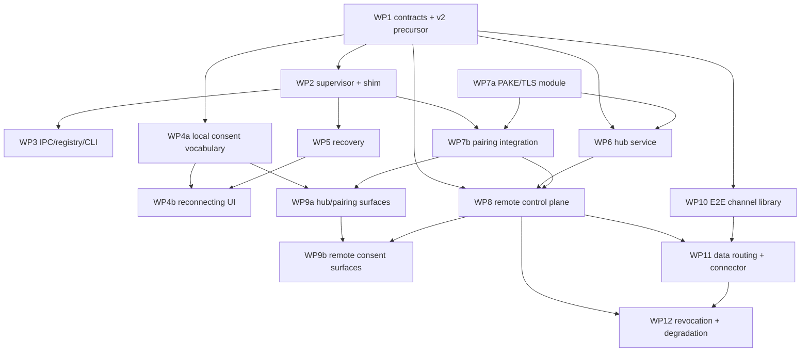

# Agent Tab Bridge — Roadmap DAG

Status: **locked** 2026-07-31, three-architect consensus (Fable, Sol, Kimi) after
independent drafting and one debate round. Nodes are the locked packets from
[WORK-PACKETS.md](WORK-PACKETS.md) (staged where staging is load-bearing); edges are
hard dependencies only — B strictly consumes A's output contract. Review gates
(RG1–RG3) gate **milestone proofs, never packet starts**; a contract-breaking
finding becomes a fix task, not a predeclared edge. Recorded risk: if RG1 surfaced a
pairing-contract defect late in WP8, rework lands in a senior-L packet — accepted
under done>perfect because gates are size-S and land early.

## Graph

## Adjacency (node → hard dependencies)

| Node | Depends on |
|---|---|
| WP1 | — (root) |
| WP7a | — (root; machine identity exists today; align fingerprint schema with WP1 before handoff) |
| WP2 | WP1 |
| WP3 | WP2 |
| WP4a (vocabulary/helpers/tokens + M2 surfaces) | WP1 |
| WP4b (reconnecting states) | WP4a, WP5 |
| WP5 | WP2 |
| WP6 | WP1, WP7a (frozen `{pinned peer key, roles, presence}` contract) |
| WP7b (supervisor/ceremony integration) | WP2, WP7a |
| WP8 | WP1, WP6, WP7b |
| WP9a (hub row/toggle/forget) | WP4a, WP7b |
| WP9b (remote consent cards, route marker) | WP9a, WP8 |
| WP10 | WP1 only — the channel authenticates opaque canonical context under WP1's schema; WP8 owns route/stream semantics |
| WP11 | WP8, WP10 (`SecureSessionChannel`) |
| WP12 | WP8, WP11 |
| RG1 | WP7b · RG2 | WP8 · RG3 | WP10 — each gates its milestone proof only |

Checkpoint driving (WP13, staged; each also depends on its predecessor stage):

| Stage | Proves | Depends on |
|---|---|---|
| 13.2 | M2 two-browser | WP2, WP3, WP4a |
| 13.3 | M3 recovery | 13.2, WP5, WP4b |
| 13.4 | M4 pairing | 13.3, WP6, WP7b, WP9a, RG1 |
| 13.5 | M5 control plane (decline-only) | 13.4, WP8, WP9b, RG2 |
| 13.6 | M6 remote E2E session | 13.5, WP10, WP11, RG3 |
| 13.7 | M7 final three-machine pass + docs | 13.6, WP12 |

## Critical path

**WP1 → WP2 → WP7b → WP8 → WP11 → WP12 → 13.7**

- WP1 starts day one with zero slack; both senior-L packets (WP2, WP8) sit on the path.
- WP7a, WP6, and WP10 run in the path's shadow (WP7a ∥ WP2; WP6 behind the frozen
  pairing contract; WP10 early on scarce expert capacity so RG3 lands before WP11
  integration needs it).
- The supervisor-local lane (WP3, WP5, WP4) and all UI packets are off-path unless a
  milestone surface slips.

## Scheduling waves (peak useful concurrency: 6 — 5 implementers + 1 expert reviewer)

| Wave | Running |
|---|---|
| 1 | WP1, WP7a |
| 2 | WP2, WP4a, WP6, WP10 |
| 3 | WP3, WP5, WP7b |
| 4 | WP8, WP4b, WP9a, RG1, 13.2, 13.3 |
| 5 | WP9b, WP11, RG2, 13.4 |
| 6 | WP12, RG3, 13.5, 13.6 |
| 7 | 13.7 (final scripted pass) |

More workers than this split single-owner files and contracts without shortening the
path.

## Human-required points

- WP7/13.4: two-machine pairing ceremony (code comparison + endpoint enable toggle).
- 13.2: Brave+Chrome installs and popup approvals.
- 13.3: mid-session reload / browser-quit recovery observation.
- 13.5: remote enrollment fingerprint match + decline-only approvals.
- 13.6: remote session approval, tab-drag revocation.
- 13.7: three-machine/container pass — approval, profile revocation, hub kill,
  port-scan inertness check.

Everything else is worker-drivable.
