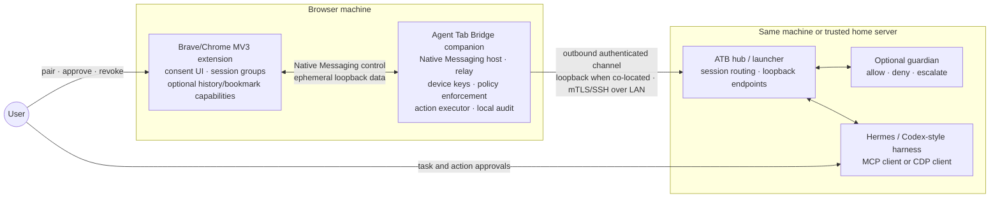
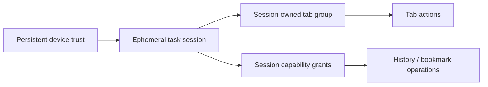
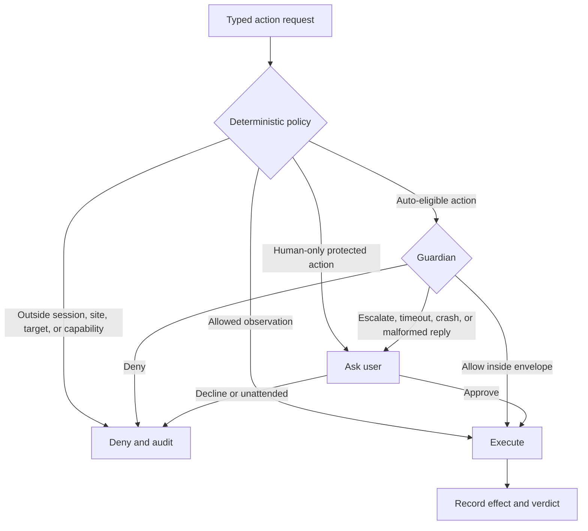

# Agent Tab Bridge roadmap

This roadmap describes capability boundaries, not dates or semver promises. It starts from the working Brave MVP and ends with a browser bridge that is usable locally or across a trusted home LAN, serves Hermes and generic agent harnesses, exposes explicitly approved browser context such as bookmarks and history, and can optionally place a guardian model in front of managed actions.

When product choices conflict, prefer the ChatGPT/Codex model: explicit capability escalation, task-scoped authority, domain approvals, persistent rules that remain visible and revocable, and a separate agent-policy layer above browser transport. Claude is useful corroboration, but not the tie-breaker.

## Current baseline

The current MVP provides:

- an ephemeral, authenticated relay bound to `127.0.0.1`;
- `BROWSER_CDP_URL` compatibility for Hermes and other CDP clients;
- a visible **Agent Tabs** consent group;
- immediate revocation when a tab leaves the group, the debugger banner is dismissed, or the relay stops; and
- Brave validation through focused relay tests and a disposable-profile smoke test.

It still requires copying a pairing string, has no persistent device identity or first-class task session, and has not been validated in Chrome. Bookmarks and browsing history are not exposed.

## North-star architecture

The trust chain is deliberately layered:

Device enrollment authenticates a browser installation; it does not authorize browser use. A task session grants no personal-tab access by itself. Tab membership and separately approved browser-data capabilities remain the browser-local consent boundaries.

## Major releases

The releases below are intentionally broad. Work within one release may be prototyped earlier, but its user-facing capability does not ship until the release boundary is satisfied.

### Baseline — Shared-tab MVP

**Outcome:** prove narrow CDP access to explicitly shared Brave tabs.

This was the repository's original regression baseline. Later releases must not weaken loopback binding, per-session tokens, target filtering, visible debugger attachment, or immediate revocation.

### Release 1 — Trusted local product

**Outcome:** installation once; thereafter one command and one browser-local approval, with no copied capability strings.

**Status:** implemented and smoke-tested with disposable Brave and Chrome-for-Testing profiles.

Major contents:

- One installable `atb` companion binary serving as Native Messaging host, relay, and CLI.
- Installer registration for both Brave and Chrome; signed/notarized packaging when distribution begins.
- Persistent extension/companion device identity, with private material in the OS keychain or an equivalently protected store.
- Authenticated controller principals: the same-host launcher key or an enrolled hub key, with optional hub-issued harness subkeys. Persistent rules bind to that principal; controller names and task labels remain unverified display text.
- First-class ephemeral task sessions: controller principal, bounded client-declared task label, mode, requested capabilities, TTL, and independent revocation.
- One visibly named tab group per active session. Agent-created tabs enter that group; dragging a tab out revokes access. A tab has at most one controller.
- `atb run -- <agent command>` injects the ephemeral `BROWSER_CDP_URL` only into the child process and revokes it on exit.
- Popup views for active sessions, shared tabs, controller identity, connection health, and one-click tab/session/device revocation.
- An explicit CDP method policy that denies profile-scoped operations not required for page control; browser-context creation and access outside session tabs remain unavailable.
- Brave and Chrome compatibility demonstrated before both are claimed.

**Release boundary:** on a fresh machine, install the extension and companion once. Later tasks require no token or port handling, leave no persistent CDP listener, and die cleanly with the launcher or browser session.

### Release 2 — Trusted home LAN

**Outcome:** a harness on a home server can request a browser session with the same browser-local consent and revocation semantics as same-host use.

Major contents:

- An `atb hub` on the harness machine and an outbound connection from the browser companion. Neither the extension nor a CDP endpoint listens directly on the LAN.
- One-time short-authentication-string enrollment using a reviewed PAKE such as [SPAKE2+](https://www.rfc-editor.org/rfc/rfc9383.html). The transcript binds both device public keys, identities, protocol version, and role; both machines verify key confirmation before storing trust.
- Mutually authenticated, pinned, encrypted transport for the stable release, with explicit key rotation and revocation. Existing SSH identity and `known_hosts` may provide the first implementation behind `atb connect`, but SSH details are not exposed in routine UX.
- Task-scoped session secrets; no reusable bearer token in a URL, log, configuration file, or notification.
- The hub re-exposes each approved browser session only as a token-gated loopback endpoint for its local harness.
- Browser popup state naming the connected server, requesting harness, task label, active capabilities, and kill switch.
- No mDNS or discovery result acts as a trust anchor. Discovery may become a convenience only after authenticated enrollment exists.

**Release boundary:** a previously enrolled home server requests a session; the browser user approves it once; Hermes receives a loopback `BROWSER_CDP_URL`; revoking the session or device closes every related channel immediately. Disabling LAN support leaves no LAN listener or reconnect loop.

### Release 3 — Browser context

**Outcome:** an agent can find a previously visited site and read or maintain bookmarks without receiving unrestricted profile-data access.

These features use dedicated extension-mediated tools. They are never added to raw CDP discovery and never inferred from tab-sharing consent.

#### Permission model

`history` and `bookmarks` are declared as optional extension permissions and requested only from a user gesture when the feature is enabled. Chromium's optional permission grant is extension-global and may persist; it is therefore prerequisite plumbing, not task consent. Every operation still requires a live trusted-device session and an application-level capability grant.

The browser warning is intentionally not softened: `history` can read and change browsing history on signed-in devices, while `bookmarks` can read and change bookmarks. The bridge exposes narrower operations than those underlying permissions allow.

#### History

- Expose bounded `history.search` and visit-detail operations only.
- Require an explicit request grant; provide no cross-session “always allow history” setting, matching ChatGPT's current history behavior.
- Execute searches inside the extension, with an explicit time range and result cap. Do not provide an unbounded export operation.
- Default agent-visible results to locally originated visits by joining bounded search results with `getVisits()` and filtering on `VisitItem.isLocal`. Recompute last-visit time and visit count from those filtered visits, and omit the aggregate `HistoryItem` title by default because its locality is not attributable. If the browser cannot report visit locality, fail the local-only request rather than silently widen it.
- Synced/profile-wide history requires a separately disclosed request. Return only the fields needed for the task and avoid full visit chains unless requested and approved.
- Do not expose `addUrl`, `deleteUrl`, `deleteRange`, or `deleteAll`. History deletion is irreversible and outside the product scope.
- Audit the capability grant, range, and result count, but not query text or returned URLs by default. A history lookup must not create a second durable browsing history.

#### Bookmarks

- Expose typed search, read, create, update, move, and soft-delete operations.
- Allow read access for one request or the current session, optionally restricted by application policy to user-selected bookmark folders. Any broader remembered grant binds to an authenticated controller principal and remains visible and revocable; the underlying browser permission is still profile-wide.
- Present bookmark mutations as a previewable operation or batch. Before Guardian Auto exists, the user approves the mutation set.
- Journal the resulting ID and expected post-image for each created node, plus pre-images for update, move, and soft-delete operations, then surface **Restore this session's bookmark changes**. Call this restore, not transactional undo: concurrent edits and recreated bookmark IDs prevent a lossless guarantee.
- Implement deletion as a move to a visible **Agent Tab Bridge Trash** folder. Permanent purge is user-only in browser UI.
- Show when a mutation affects synchronized bookmarks where the browser exposes that information. Exclude managed/unmodifiable nodes.
- Keep restore records bounded and browser-local. Send only the minimized result of an approved bookmark operation over its authenticated session channel; never put bookmark contents in audit logs, telemetry, or unsolicited synchronization.

A versioned control protocol and a minimal MCP facade expose these capabilities to Hermes adapters and generic harnesses. Raw `BROWSER_CDP_URL` clients receive no implicit access.

**Release boundary:** “find the site I visited last week” returns bounded, explicitly approved results; bookmark changes show an exact preview and can be restored from the popup; disabling either optional permission removes the capability without breaking shared-tab control.

### Release 4 — Managed actions and policy

**Outcome:** policy-aware harnesses can use an auditable browser action interface instead of opaque CDP while CDP compatibility remains available.

There are two mutually exclusive session types:

| Session type | Interface | Enforced boundary | Guardian eligibility |
|---|---|---|---|
| CDP compatibility | `BROWSER_CDP_URL` | Device, session, shared targets, deterministic CDP method restrictions | No; actions inside a shared page are opaque |
| Managed actions | Versioned control protocol / MCP | Device, session, targets, capability grants, typed action policy | Yes, beginning in Release 5 |

Managed sessions do not mint a raw CDP capability. The companion executes typed verbs such as navigate, read, click, type, scroll, wait, open/close tab, history search, and bookmark operations. Each request has a stable action ID, target, effect class, and post-action result.

Policy and UX prefer the ChatGPT/Codex shape:

- Ask before using a new site, with **Allow once**, **Allow for this site**, **Allow for this session**, and **Decline**.
- Explicit allow/block management bound to an authenticated controller principal, never its self-reported name.
- A clearly elevated all-sites session option, never implied by pairing.
- Separate capability prompts for profile data, downloads/uploads, authorization grants, and other protected actions.
- A bounded, client-declared task label and requested-site list displayed as unverified context—not treated as proof of intent.
- Deterministic rules run before any later model reviewer. Out-of-session targets, missing capabilities, credential values, and permanent deletion requests cannot be authorized by model judgment.

The local intervention log records action ID, effect class, target origin, policy verdict, approver, revocation, and mode transitions. It excludes secrets, form values, page bodies, history results, bookmark contents, and capability tokens. Users can inspect, purge, or explicitly export it.

A Hermes adapter may continue using CDP or adopt managed actions. Other harnesses can use the MCP facade without knowing CDP.

**Release boundary:** a managed client completes a representative multi-site task using typed actions and capability requests; every committing action is attributable and reviewable; a raw CDP client still works but the UI accurately labels it **target-contained, action-uninterpreted**.

### Release 5 — Guardian Auto

**Outcome:** low-risk managed actions can proceed without individual prompts while a second model reviews actions inside the user's previously approved envelope.

The guardian is the final release because it depends on stable sessions, typed actions, policy, effect classes, capability grants, and audit. It is not an authorization root.

Architectural requirements:

- Auto is available only to managed sessions. A session with raw `BROWSER_CDP_URL` can be audited heuristically but cannot make an action-safety claim: `Runtime.evaluate` and synthesized input are semantically opaque.
- The guardian runs as a separate trusted process inside the ATB approval path, outside the browser extension and outside the agent process. Deployment may co-locate it with the companion or hub, but the final executor rejects missing or invalid decisions.
- Inputs are minimized structured evidence: typed verb and arguments, session scope, target origin/title, recent relevant actions, deterministic policy result, and only the page excerpt needed for review.
- Verdicts are `allow`, `deny`, or `escalate`, with a concise rationale linked to the action ID.
- A guardian allow can only narrow prompts inside the user's existing policy envelope. It cannot create a session, add a site, share a tab, grant history/bookmark access, reveal credentials, or authorize permanent deletion.
- Guardian unavailable, timed out, changed mid-session, or unable to write the intervention log means Auto turns off. The action escalates to a human; unattended execution denies it. There is no silent downgrade to unreviewed execution.
- Repeated denials or human overrides trip a circuit breaker back to Ask mode.
- Bookmark create/update/move may become Auto-eligible only inside an explicit session grant and with a valid restore journal. Soft-delete remains human-approved. History access remains user-granted rather than guardian-granted.
- Model/provider choice is replaceable. A local model is the privacy-preserving default; any remote guardian requires explicit configuration and disclosure of what evidence leaves the machine.

The honest product claim is **supervised autonomy inside an approved session**, not “safe browsing.” Semantic navigate/click/type actions still compose into substantial page control, and page content remains untrusted.

**Release boundary:** Auto can be enabled only on a managed session; policy violations are deterministically denied; eligible actions are synchronously reviewed; failures return to Ask or deny; every decision is inspectable; no UI implies that raw CDP traffic is guardian-protected.

## Architectural decisions

### Three planes, three gates

- **Transport plane:** Native Messaging, loopback relay, authenticated LAN tunnel, capability lifecycle.
- **Consent plane:** persistent device enrollment, ephemeral task sessions, tab-group ownership, profile-data grants, revocation.
- **Intent plane:** harness plan, typed action semantics, policy, user approval, optional guardian.

The corresponding gates are device trust, task session, and session-owned tabs/capabilities. No earlier gate implies a later one.

### Native companion, not extension-direct LAN

The extension talks only to its registered native companion and ephemeral loopback transport. The companion owns OS identity, networking, process lifecycle, and LAN tunneling. This keeps TLS, key storage, SSH, and server routing out of an MV3 service worker.

### Outbound LAN channel

The browser companion dials an enrolled hub; raw CDP remains loopback on the harness host. There is no extension-direct LAN socket and no LAN-visible DevTools endpoint. SSH is an acceptable hidden transport while validating the topology; stable general-user enrollment uses pinned mutual authentication.

### Optional browser permissions are not consent

`chrome.permissions.request()` reduces install-time privilege and gives the user platform warning context. It does not express controller, task, query, or operation scope. The extension's session capability is the enforceable application boundary.

### Profile data is a separate capability plane

Sharing a tab never grants bookmarks or history. Those APIs are mediated by explicit typed operations, bounded locally, and unavailable to raw CDP clients. History is search/review only; bookmark writes carry preview and restore semantics.

### Raw CDP and managed actions remain distinct

Target containment is enforceable for raw CDP; action intent is not. Guardian Auto therefore requires a managed session that never receives a `/cdp` capability. This avoids presenting CDP-method inspection as a meaningful intent boundary.

### ChatGPT/Codex parity is the product tie-breaker

Adopt its domain approval vocabulary, separate history grants, visible persistent rule management, task-scoped capability escalation, and distinction between browser transport and agent policy. Do not copy its broad permission set unless a roadmap capability requires it.

## Deliberate non-goals

- Public-internet relay, cloud rendezvous, or an Agent Tab Bridge account service.
- Persistent remote-debugging port or LAN-visible CDP endpoint.
- Browser-history modification or deletion.
- Unbounded history/bookmark export.
- Silent profile-data access because the extension permission was previously granted.
- Guardian claims over raw CDP sessions.
- Guardian-based approval of device enrollment, tab sharing, capability grants, credentials, or permanent deletion.
- Agent chat, memory, scheduling, or model inference in the extension.
- mDNS, QR, or a discovered host as a trust anchor.
- Firefox, Safari, mobile browsers, multi-user tenancy, or enterprise policy in the releases above.

## Validation obligations

Each release retains the MVP's revocation and authentication proofs. Additional acceptance scenarios include:

- Brave and Chrome Native Messaging installation, MV3 suspension/reconnect, update, unpair, browser quit, and companion crash.
- Concurrent task sessions, tab ownership conflicts, stale groups after restart, and revocation during an in-flight command.
- LAN attacker enrollment attempts, certificate rotation/revocation, hub loss, replay, and proof that no CDP socket binds beyond loopback.
- Optional permission grant, denial, removal, managed-policy denial, browser restart, incognito exclusion, and extension update.
- History searches with local and synced visits, bounded performance, empty ranges, and result-minimization checks in Brave and Chrome.
- Bookmark sync on/off, managed nodes, concurrent user edits, burst handling and application-level throttles, partial mutation failure, soft-delete, and conflict-aware restore.
- Mode-confusion tests proving managed sessions cannot obtain CDP and raw-CDP sessions cannot enable Auto.
- Guardian timeout, crash, malformed verdict, model/config change, audit failure, policy conflict, prompt-injection fixtures, and circuit-breaker behavior.

## References

Product behavior and parity:

- [OpenAI: Chrome extension](https://learn.chatgpt.com/docs/chrome-extension) — domain approvals, allow/block management, request-scoped history access, native-host troubleshooting, tab groups, and declared permission surface.
- [Anthropic: Claude in Chrome permissions guide](https://support.claude.com/en/articles/12902446-claude-in-chrome-permissions-guide) — useful secondary comparison for permission modes, protected actions, site rules, and explicit hard stops.

Chromium platform:

- [Chrome Native Messaging](https://developer.chrome.com/docs/extensions/develop/concepts/native-messaging)
- [Chrome optional permissions](https://developer.chrome.com/docs/extensions/reference/api/permissions)
- [Chrome permission declarations and warnings](https://developer.chrome.com/docs/extensions/develop/concepts/declare-permissions)
- [Chrome permission warning list](https://developer.chrome.com/docs/extensions/reference/permissions-list)
- [`chrome.history`](https://developer.chrome.com/docs/extensions/reference/api/history)
- [`chrome.bookmarks`](https://developer.chrome.com/docs/extensions/reference/api/bookmarks)
- [`chrome.debugger`](https://developer.chrome.com/docs/extensions/reference/api/debugger)
- [Chrome remote-debugging-port changes](https://developer.chrome.com/blog/remote-debugging-port)
- [Brave: installing Chromium extensions](https://support.brave.com/hc/en-us/articles/360017909112-How-can-I-add-extensions-to-Brave)
- [SPAKE2+ authenticated key exchange (RFC 9383)](https://www.rfc-editor.org/rfc/rfc9383.html)

Project provenance and present behavior remain documented in [`README.md`](README.md), [`upstream/README.md`](upstream/README.md), and [`THIRD_PARTY_NOTICES.md`](THIRD_PARTY_NOTICES.md).
